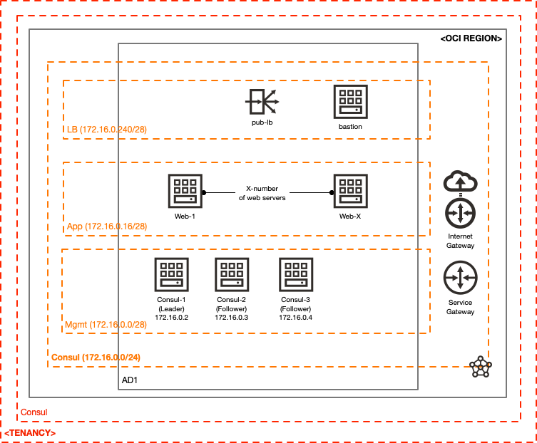

# Consul Testing & Validation on OCI

[](https://img.shields.io/badge/license-UPL-green)

## Introduction
This repository contains a bare-bones environment that runs [Consul](https://www.consul.io), intended to test and validate [Consul](https://www.consul.io) on top of [Oracle Cloud Infrastructure (OCI)](https://www.oracle.com/cloud?source=:ex:tb:::::WWMK211203P00003&SC=:ex:tb:::::WWMK211203P00003&pcode=WWMK211203P00003).

Here's the topology it deploys:

[]

Here's a quick summary of what's deployed:
* A small Consul cluster (three servers) is deployed
* A bastion (it's not a proper, hardened bastion - it's really just an instance that can be SSH'd to)
* 1+ web servers (added to the LB Backend Set)
* A public LB, which is accessible by a public IP address (it's highly recommended to limit it to your own public IP address, as the LB does not use any encryption)

## Getting Started
### Sensitive Values to Record
It would be a good idea to keep track of the encryption key (found in `/tmp/keygen`) used for encrypting/securing gossip communications.  You'll also want to store the super-user secret/token (found in `tmp/consul_bootstrap`) which might be needed at a later time.  Log these in your favorite password manager or on a sticky by your monitor (no, this really isn't a good idea - don't do it).  These are available on any of the Consul servers.

### Accessing the Consul Web UI
You'll need to do a bit of port-forwarding trickery to get this working:

```
ssh -L 8500:172.16.0.2:8500 -i <your_SSH_private_key> -A opc@<bastion_public_ip>
```

Once this is running, point your web browser to `http://127.0.0.1:8500`.  If you get to a screen that requires you to login, use the `SecretID` found in `/tmp/consul_bootstrap`.  This is your "super-user" token (for lack of a better definition).

### Visiting the LB
You may visit the LB by going to the public IP in your web browser.  Note that there is no encryption used (this is only a sample, not a production-ready use-case).

### Prerequisites
You must have an OCI account.  [Click here](https://www.oracle.com/cloud/free/?source=:ex:tb:::::WWMK211203P00003&SC=:ex:tb:::::WWMK211203P00003&pcode=WWMK211203P00003) to create a new cloud account.

## Requirements

| Name | Version |
|------|---------|
| <a name="requirement_terraform"></a> [terraform](#requirement\_terraform) | >= 0.13.5 |

## Providers

| Name | Version |
|------|---------|
| <a name="provider_oci"></a> [oci](#provider\_oci) | 4.39.0 |
| <a name="provider_oci.home"></a> [oci.home](#provider\_oci.home) | 4.39.0 |
| <a name="provider_oci.rgn1"></a> [oci.rgn1](#provider\_oci.rgn1) | 4.39.0 |
| <a name="provider_random"></a> [random](#provider\_random) | 3.1.0 |
| <a name="provider_tls"></a> [tls](#provider\_tls) | 3.1.0 |

## Modules

No modules.

## Resources

| Name | Type |
|------|------|
| [oci_core_dhcp_options.rgn1](https://registry.terraform.io/providers/hashicorp/oci/latest/docs/resources/core_dhcp_options) | resource |
| [oci_core_instance.bastion_rgn1](https://registry.terraform.io/providers/hashicorp/oci/latest/docs/resources/core_instance) | resource |
| [oci_core_instance.consul_1_rgn1](https://registry.terraform.io/providers/hashicorp/oci/latest/docs/resources/core_instance) | resource |
| [oci_core_instance.consul_2_rgn1](https://registry.terraform.io/providers/hashicorp/oci/latest/docs/resources/core_instance) | resource |
| [oci_core_instance.consul_3_rgn1](https://registry.terraform.io/providers/hashicorp/oci/latest/docs/resources/core_instance) | resource |
| [oci_core_instance.cts_rgn1](https://registry.terraform.io/providers/hashicorp/oci/latest/docs/resources/core_instance) | resource |
| [oci_core_instance.web_rgn1](https://registry.terraform.io/providers/hashicorp/oci/latest/docs/resources/core_instance) | resource |
| [oci_core_internet_gateway.rgn1](https://registry.terraform.io/providers/hashicorp/oci/latest/docs/resources/core_internet_gateway) | resource |
| [oci_core_nat_gateway.rgn1](https://registry.terraform.io/providers/hashicorp/oci/latest/docs/resources/core_nat_gateway) | resource |
| [oci_core_network_security_group.bastion_rgn1](https://registry.terraform.io/providers/hashicorp/oci/latest/docs/resources/core_network_security_group) | resource |
| [oci_core_network_security_group.consul_rgn1](https://registry.terraform.io/providers/hashicorp/oci/latest/docs/resources/core_network_security_group) | resource |
| [oci_core_network_security_group.lb_rgn1](https://registry.terraform.io/providers/hashicorp/oci/latest/docs/resources/core_network_security_group) | resource |
| [oci_core_network_security_group.web_rgn1](https://registry.terraform.io/providers/hashicorp/oci/latest/docs/resources/core_network_security_group) | resource |
| [oci_core_network_security_group_security_rule.e_to_consul_8500](https://registry.terraform.io/providers/hashicorp/oci/latest/docs/resources/core_network_security_group_security_rule) | resource |
| [oci_core_network_security_group_security_rule.e_to_consul_rgn1](https://registry.terraform.io/providers/hashicorp/oci/latest/docs/resources/core_network_security_group_security_rule) | resource |
| [oci_core_network_security_group_security_rule.e_to_consul_ssh](https://registry.terraform.io/providers/hashicorp/oci/latest/docs/resources/core_network_security_group_security_rule) | resource |
| [oci_core_network_security_group_security_rule.i_from_bastion_compute_8500](https://registry.terraform.io/providers/hashicorp/oci/latest/docs/resources/core_network_security_group_security_rule) | resource |
| [oci_core_network_security_group_security_rule.i_from_bastion_compute_ssh](https://registry.terraform.io/providers/hashicorp/oci/latest/docs/resources/core_network_security_group_security_rule) | resource |
| [oci_core_network_security_group_security_rule.i_from_consul_rgn1](https://registry.terraform.io/providers/hashicorp/oci/latest/docs/resources/core_network_security_group_security_rule) | resource |
| [oci_core_network_security_group_security_rule.i_to_lb](https://registry.terraform.io/providers/hashicorp/oci/latest/docs/resources/core_network_security_group_security_rule) | resource |
| [oci_core_network_security_group_security_rule.i_to_web](https://registry.terraform.io/providers/hashicorp/oci/latest/docs/resources/core_network_security_group_security_rule) | resource |
| [oci_core_route_table.private_rgn1](https://registry.terraform.io/providers/hashicorp/oci/latest/docs/resources/core_route_table) | resource |
| [oci_core_route_table.public_rgn1](https://registry.terraform.io/providers/hashicorp/oci/latest/docs/resources/core_route_table) | resource |
| [oci_core_security_list.rgn1_mgmt](https://registry.terraform.io/providers/hashicorp/oci/latest/docs/resources/core_security_list) | resource |
| [oci_core_subnet.app_rgn1](https://registry.terraform.io/providers/hashicorp/oci/latest/docs/resources/core_subnet) | resource |
| [oci_core_subnet.lb_rgn1](https://registry.terraform.io/providers/hashicorp/oci/latest/docs/resources/core_subnet) | resource |
| [oci_core_subnet.mgmt_rgn1](https://registry.terraform.io/providers/hashicorp/oci/latest/docs/resources/core_subnet) | resource |
| [oci_core_vcn.rgn1](https://registry.terraform.io/providers/hashicorp/oci/latest/docs/resources/core_vcn) | resource |
| [oci_identity_compartment.consul](https://registry.terraform.io/providers/hashicorp/oci/latest/docs/resources/identity_compartment) | resource |
| [oci_identity_tag.release](https://registry.terraform.io/providers/hashicorp/oci/latest/docs/resources/identity_tag) | resource |
| [oci_identity_tag_namespace.devrel](https://registry.terraform.io/providers/hashicorp/oci/latest/docs/resources/identity_tag_namespace) | resource |
| [oci_load_balancer_backend.rgn1](https://registry.terraform.io/providers/hashicorp/oci/latest/docs/resources/load_balancer_backend) | resource |
| [oci_load_balancer_backend_set.web_rgn1](https://registry.terraform.io/providers/hashicorp/oci/latest/docs/resources/load_balancer_backend_set) | resource |
| [oci_load_balancer_listener.web_rgn1](https://registry.terraform.io/providers/hashicorp/oci/latest/docs/resources/load_balancer_listener) | resource |
| [oci_load_balancer_load_balancer.pub_rgn1](https://registry.terraform.io/providers/hashicorp/oci/latest/docs/resources/load_balancer_load_balancer) | resource |
| [random_id.tag](https://registry.terraform.io/providers/hashicorp/random/latest/docs/resources/id) | resource |
| [tls_private_key.node_to_node](https://registry.terraform.io/providers/hashicorp/tls/latest/docs/resources/private_key) | resource |
| [oci_core_images.this](https://registry.terraform.io/providers/hashicorp/oci/latest/docs/data-sources/core_images) | data source |
| [oci_core_services.rgn1](https://registry.terraform.io/providers/hashicorp/oci/latest/docs/data-sources/core_services) | data source |
| [oci_identity_availability_domains.rgn1_ads](https://registry.terraform.io/providers/hashicorp/oci/latest/docs/data-sources/identity_availability_domains) | data source |
| [oci_identity_region_subscriptions.home_region_subscriptions](https://registry.terraform.io/providers/hashicorp/oci/latest/docs/data-sources/identity_region_subscriptions) | data source |

## Inputs

| Name | Description | Type | Default | Required |
|------|-------------|------|---------|:--------:|
| <a name="input_compartment_ocid"></a> [compartment\_ocid](#input\_compartment\_ocid) | The compartment OCID to deploy resources to | `string` | `""` | no |
| <a name="input_compute_image_name"></a> [compute\_image\_name](#input\_compute\_image\_name) | The name of the compute image to use for the compute instances. | `any` | n/a | yes |
| <a name="input_fingerprint"></a> [fingerprint](#input\_fingerprint) | 'API Key' fingerprint, more details can be found at https://docs.cloud.oracle.com/en-us/iaas/Content/General/Concepts/credentials.htm?source=:ex:tb:::::WWMK211203P00003&SC=:ex:tb:::::WWMK211203P00003&pcode=WWMK211203P00003#two | `string` | `""` | no |
| <a name="input_lb_priv_key"></a> [lb\_priv\_key](#input\_lb\_priv\_key) | The file name of the private key to use for the LB. | `string` | `"lb.key"` | no |
| <a name="input_lb_pub_key"></a> [lb\_pub\_key](#input\_lb\_pub\_key) | The file name of the public key to use for the LB. | `string` | `"lb.crt"` | no |
| <a name="input_my_public_ip"></a> [my\_public\_ip](#input\_my\_public\_ip) | The public IP address of your machine (what is permitted to talk to the LB listener). | `string` | n/a | yes |
| <a name="input_num_consul_svrs"></a> [num\_consul\_svrs](#input\_num\_consul\_svrs) | The number of Consul servers to deploy in each region. | `number` | `3` | no |
| <a name="input_num_web_svrs"></a> [num\_web\_svrs](#input\_num\_web\_svrs) | The number of web servers to deploy in each region. | `number` | `2` | no |
| <a name="input_private_key"></a> [private\_key](#input\_private\_key) | The private key (provided as a string value) | `string` | `""` | no |
| <a name="input_private_key_password"></a> [private\_key\_password](#input\_private\_key\_password) | The password to use for the private key | `string` | `""` | no |
| <a name="input_private_key_path"></a> [private\_key\_path](#input\_private\_key\_path) | Path to private key used to create OCI 'API Key', more details can be found at https://docs.cloud.oracle.com/en-us/iaas/Content/General/Concepts/credentials.htm?source=:ex:tb:::::WWMK211203P00003&SC=:ex:tb:::::WWMK211203P00003&pcode=WWMK211203P00003#two | `string` | `""` | no |
| <a name="input_region_1"></a> [region\_1](#input\_region\_1) | OCI Region as documented at https://docs.cloud.oracle.com/en-us/iaas/Content/General/Concepts/regions.htm?source=:ex:tb:::::WWMK211203P00003&SC=:ex:tb:::::WWMK211203P00003&pcode=WWMK211203P00003 | `string` | `"us-phoenix-1"` | no |
| <a name="input_region_2"></a> [region\_2](#input\_region\_2) | OCI Region as documented at https://docs.cloud.oracle.com/en-us/iaas/Content/General/Concepts/regions.htm?source=:ex:tb:::::WWMK211203P00003&SC=:ex:tb:::::WWMK211203P00003&pcode=WWMK211203P00003 | `string` | `"us-ashburn-1"` | no |
| <a name="input_ssh_priv_key"></a> [ssh\_priv\_key](#input\_ssh\_priv\_key) | The contents of the private key used for SSH connections. | `string` | `""` | no |
| <a name="input_ssh_priv_key_path"></a> [ssh\_priv\_key\_path](#input\_ssh\_priv\_key\_path) | The path to the private key used for SSH connections. | `string` | `""` | no |
| <a name="input_ssh_pub_key"></a> [ssh\_pub\_key](#input\_ssh\_pub\_key) | The SSH public key contents to use for the compute instances. | `string` | `""` | no |
| <a name="input_ssh_pub_key_path"></a> [ssh\_pub\_key\_path](#input\_ssh\_pub\_key\_path) | The path to the SSH public key to use for the compute instances. | `string` | `""` | no |
| <a name="input_tenancy_ocid"></a> [tenancy\_ocid](#input\_tenancy\_ocid) | OCI tenant OCID, more details can be found at https://docs.cloud.oracle.com/en-us/iaas/Content/API/Concepts/apisigningkey.htm?source=:ex:tb:::::WWMK211203P00003&SC=:ex:tb:::::WWMK211203P00003&pcode=WWMK211203P00003#five | `any` | n/a | yes |
| <a name="input_user_ocid"></a> [user\_ocid](#input\_user\_ocid) | OCI user OCID, more details can be found at https://docs.cloud.oracle.com/en-us/iaas/Content/API/Concepts/apisigningkey.htm?source=:ex:tb:::::WWMK211203P00003&SC=:ex:tb:::::WWMK211203P00003&pcode=WWMK211203P00003#five | `string` | `""` | no |

## Outputs

| Name | Description |
|------|-------------|
| <a name="output_bastion_pub_ip"></a> [bastion\_pub\_ip](#output\_bastion\_pub\_ip) | n/a |
| <a name="output_rgn1_lb_pub_ip"></a> [rgn1\_lb\_pub\_ip](#output\_rgn1\_lb\_pub\_ip) | n/a |

## Notes/Issues
None at this time.

## URLs
### Consul Installation
* https://devopscube.com/setup-consul-cluster-guide/
* https://learn.hashicorp.com/tutorials/consul/deployment-guide

## Contributing
This project is open source.  Please submit your contributions by forking this repository and submitting a pull request!  Oracle appreciates any contributions that are made by the open source community.

## License
Copyright (c) 2021 Oracle and/or its affiliates.

Licensed under the Universal Permissive License (UPL), Version 1.0.

See [LICENSE](LICENSE) for more details.
